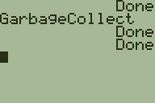

# TIDE
This is the start of an IDE for the monochrome TI-83+/84+ series of calculators.

Here is a current example, in which we see that it:
* loads the file
* displays it line-by-line
* can traverse via left and right arrow keys
* can open a menu with multiple headers and select an entry
* can edit the file and successfully save

**

What is not shown:
* dynamic tokenizing-- in the example implementation, if you type `LINE(`, it
  will convert this to the `Line(` token.
* dynamic *re*tokenizing-- when the tokens `W` or `I` are followed by  `Line(` they will be displayed as `WhiteLine(` or `InvertLine(`, respectively, and are treated as one, multi-byte token.

# To Build
I use [spasm-ng](https://github.com/alberthdev/spasm-ng) to compile this
project. For other compilers, you may need some tweaking and you'll probably
need to figure out an app signing tool.

In order to build this project, you will also need the
[Z80 Optimized Routines](https://github.com/Zeda/Z80-Optimized-Routines)
repository in the same directory as TIDE. You probably don't need the whole
repository history, so you can do:
```
git clone --depth 1 https://github.com/Zeda/TIDE.git
git clone --depth 1 https://github.com/Zeda/Z80-Optimized-Routines.git
```
But if you do want the whole history, just omit the `--depth 1`.

Then to compile, move into the TIDE directory and either execute the compile
script:
```./compile```

Or manually do it:
```
spasm src/TIDE.z80 bin/TIDE.8xk -I src -I ../Z80-Optimized-Routines
```
